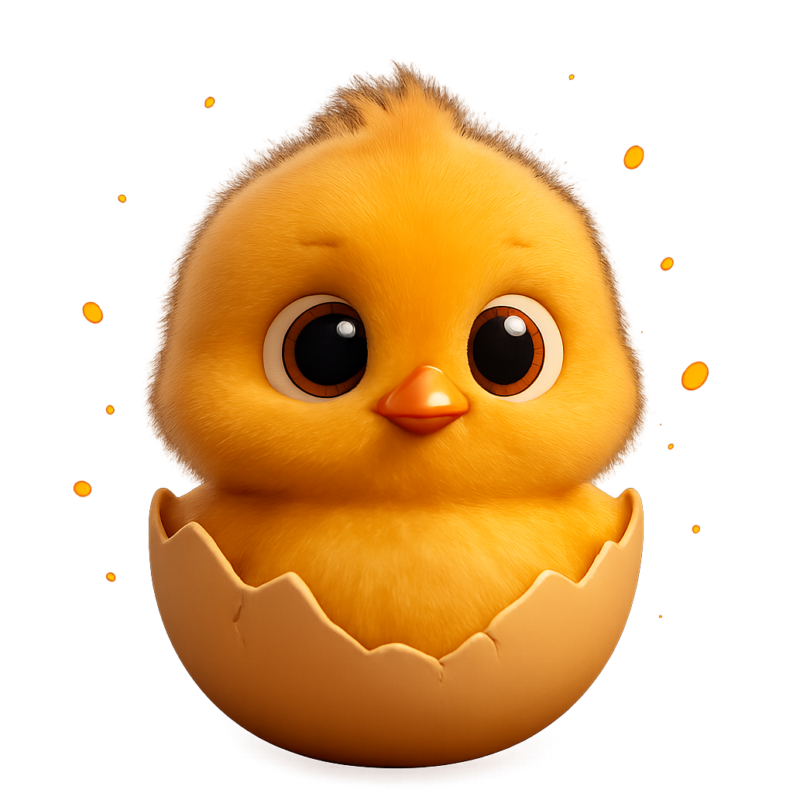
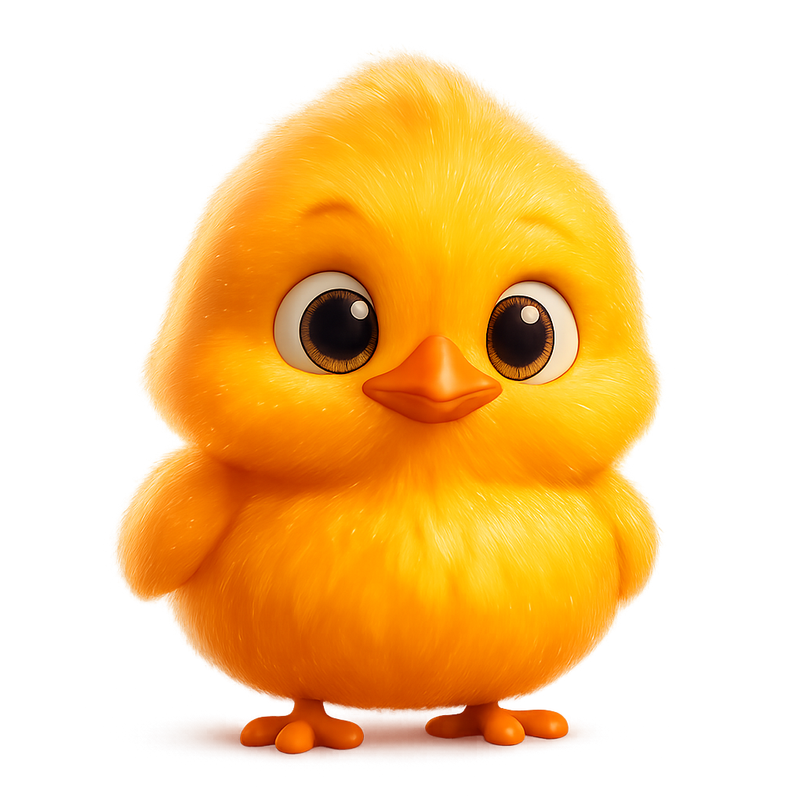
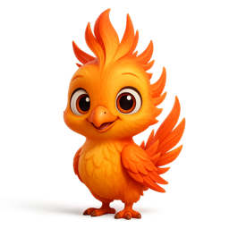
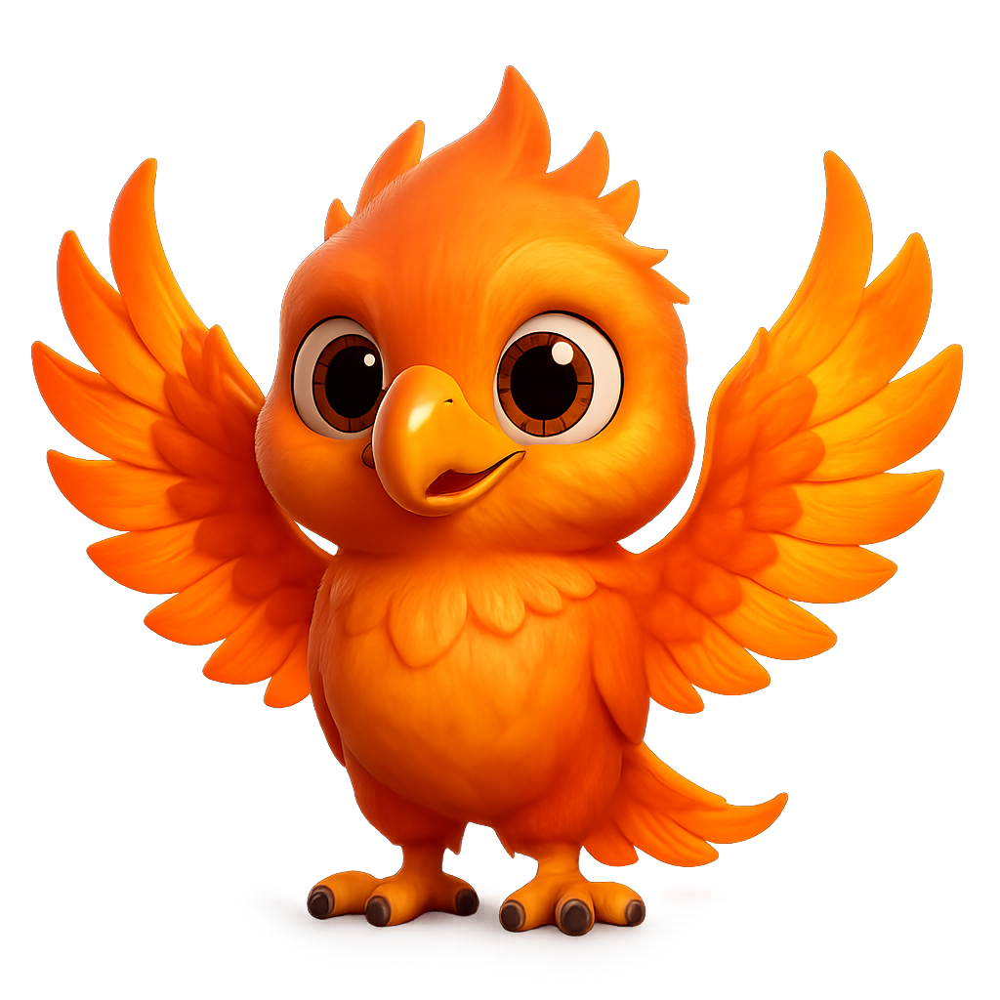
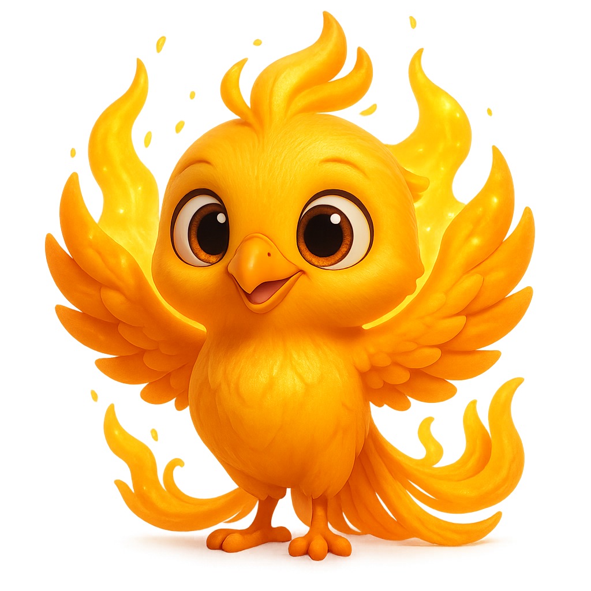
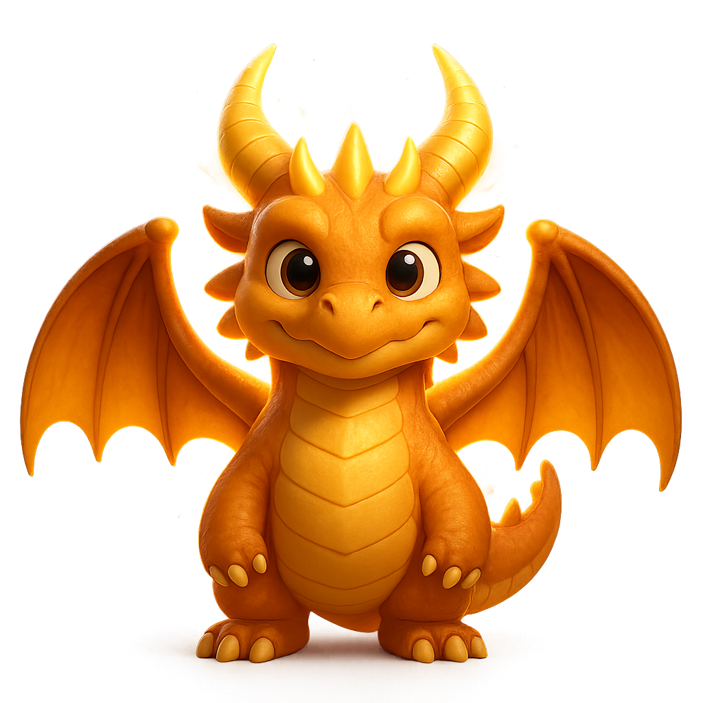
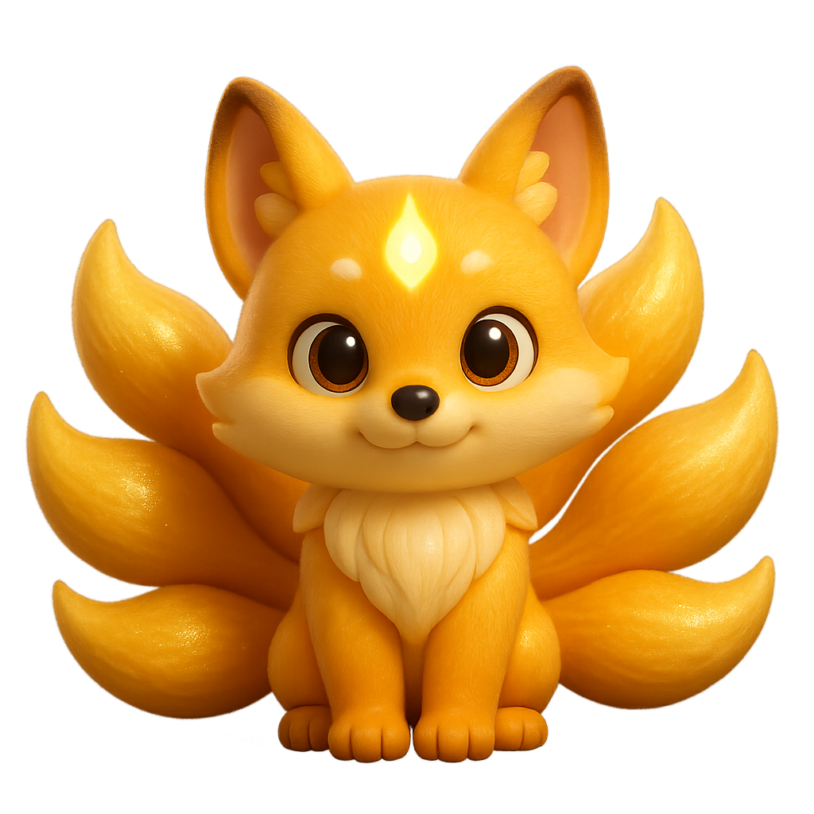
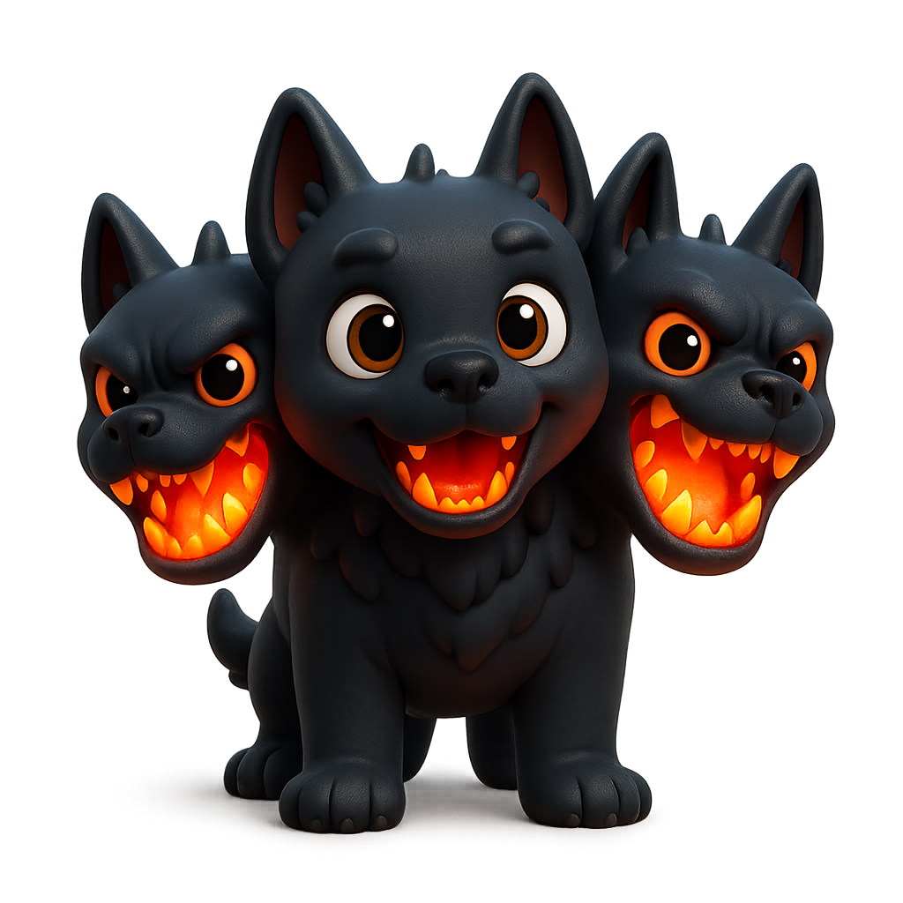
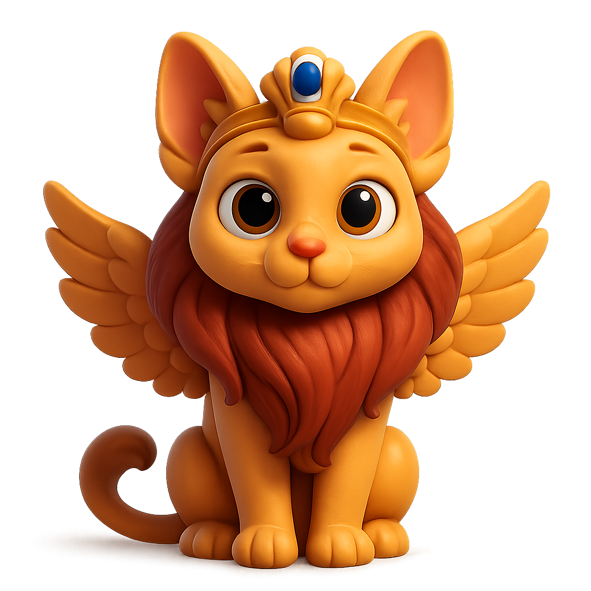
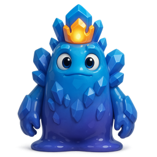

# claude-pet

> A desktop companion that grows as you code with Claude Code.


**claude-pet** is a [Claude Code](https://docs.claude.com/en/docs/claude-code) plugin. A small, always-on-top pet floats on your desktop and **levels up from your real coding activity** — every commit, passing test, and shipped feature grows it from a humble egg into a legendary creature. It also keeps an eye on your session and gently nudges you when your context window is filling up, when uncommitted work is piling up, or when it's time for a break.

It is built around one hard rule: **the pet never touches your project.** The hooks only *observe* activity and write to a private state directory, and the only git commands they ever run are read-only.

<p align="center">
  
  
  
  
  
  
</p>
<p align="center"><em>The phoenix line — egg → hatchling → juvenile → adolescent → adult → legendary</em></p>

## Highlights

- **Grows as you code.** XP comes from commits (a `feat` is worth more than a `chore`), passing tests, new files, milestones, and tokens, with a daily-streak multiplier. Six levels carry your pet from egg to a legendary final form, with a celebratory flash at every evolution.
- **Six evolution lines.** Adopt a phoenix, dragon, kitsune, cerberus, sphinx, or golem — each grows through six hand-generated cartoon-3D forms.
- **Moods you can read at a glance.** The pet's body language reflects how things are going: peppy when you're in flow, drowsy when idle, and an anxious sway (plus an encouraging word) when tests keep failing.
- **Gentle reminders.** Speech bubbles for a near-full context window, uncommitted changes piling up, or a long stretch without a break.
- **Lives on your desktop.** A frameless, transparent, always-on-top window. Drag it anywhere (it remembers), click for a stats panel, double-click to feed it a treat — and it wanders along the bottom edge on its own. Clicks pass through everywhere except the pet itself.
- **Read-only by design, and tested.** Pure-Node engine with zero runtime dependencies, 82 tests, and a dedicated suite that enforces the no-side-effects invariant.

## How it works

A decoupled, two-stage architecture: hooks observe and persist; the widget reads and renders. The two halves communicate only through files under `~/.claude-pet/`, so the engine is fully testable without a GUI and can never affect your repository.

```
Claude Code session
   │   SessionStart · PostToolUse(Edit|Write|MultiEdit|Bash) · Stop
   ▼
 bin/hook.js ── reads ──▶ git status/log (read-only) · transcript · session cost
   │
   │ writes (only here)
   ▼
 ~/.claude-pet/pet.json     persistent pet: level, xp, mood, achievements
 ~/.claude-pet/status.json  latest project snapshot: context %, cost, alerts
   │
   │ file watch
   ▼
 Electron widget (widget/main.cjs) ── renders ──▶ the floating pet
```

## Requirements

- Node.js ≥ 18
- Claude Code (for the hooks, commands, and skill)
- Electron — installed as a dev dependency by `npm install`; only needed to display the widget
- macOS, Windows, or Linux (the transparent, always-on-top window behaves best on macOS)

## Installation

### As a Claude Code plugin (recommended)

```
/plugin marketplace add wangkuan100-cell/claude-pet
/plugin install claude-pet
```

### From source

```
git clone https://github.com/wangkuan100-cell/claude-pet.git
cd claude-pet
npm install     # pulls Electron for the widget
node --test     # optional: run the test suite
```

## Usage

### Adopt and grow

```
/pet adopt dragon            # phoenix · dragon · kitsune · cerberus · sphinx · golem
/pet                         # status: level, mood, xp, project, alerts
/pet rename Ember            # give it a name
/pet milestone "shipped v1"  # log a milestone (+300 xp)
```

Outside Claude Code the same commands work via `node bin/pet.js <command>`.

### Show the pet

```
/pet start       # launch the floating widget
/pet stop        # hide it
npm run widget   # or run it directly
```

Set `CLAUDE_PET_AUTOLAUNCH=1` to open the widget automatically at session start.

### Interacting with the widget

- **Drag** the pet to move it anywhere — it remembers where you put it.
- **Click** to open or close the stats panel (level, XP bar, mood, project, achievements).
- **Double-click** to feed it a treat — a small mood boost, with floating hearts.
- It **wanders** along the bottom edge on its own every ~40s (opt out with `CLAUDE_PET_WANDER=0`).
- The window is **click-through** everywhere except the pet, so it never blocks what's behind it.

## The growth model

### XP

| Event | XP |
|---|---|
| Commit — `feat` | 120 |
| Commit — `fix` | 60 |
| Commit — `refactor` / `perf` | 50 |
| Commit — `test` / `docs` / `chore` / other | 40 |
| Milestone | 300 |
| Passing test | 40 (cap 160 / session) |
| New file | 15 |
| Lines changed | 1 each (cap 30 / event, 200 / session) |
| Tokens | 5 per 100k |

A daily **streak** multiplies earned XP up to 2×.

### Levels and forms

| Level | Cumulative XP | Form |
|---|---|---|
| 1 | 0 | egg |
| 2 | 150 | hatchling |
| 3 | 450 | juvenile |
| 4 | 1,000 | adolescent |
| 5 | 2,200 | adult |
| 6+ | 4,500+ | legendary |

### Mood

Mood starts at 80/100. Good events raise it; it decays about 5 points per hour while idle. Rather than a label, mood is shown through the pet's animation — flow, happy, normal, sleepy, bored. Three failing tests in a row turn it *worried*: it sways and offers an encouraging message, instead of penalizing the normal red-test phase of TDD.

### Reminders

The pet raises a speech bubble when:

- the context window is ≥ 80% full → suggests `/compact`
- 15+ files are uncommitted, or there's been no commit in 2 hours → suggests committing
- it's been 90+ minutes without a break → suggests a rest

### Achievements

`first-hatch` · `first-feat` · `first-green` · `first-release` · `week-streak` (7-day streak) · `century` (100 commits)

## Evolution lines

<p align="center">
  
  
  
  
  
  
</p>

phoenix 凤凰 🔥 · dragon 龙王 🐉 · kitsune 九尾狐 ✨ · cerberus 地狱犬 🐺 · sphinx 狮身兽 🦁 · golem 魔像王 💎

## Configuration

| Variable | Default | Purpose |
|---|---|---|
| `CLAUDE_PET_HOME` | `~/.claude-pet` | State directory (handy for fixtures/demos) |
| `CLAUDE_PET_WANDER` | on | Set to `0` to stop the pet wandering |
| `CLAUDE_PET_AUTOLAUNCH` | off | Set to `1` to open the widget at session start |
| `CLAUDE_PET_CONTEXT_WINDOW` | `200000` | Token budget used to estimate context % |

## Art

The 36 sprites (6 lines × 6 forms) are generated with the OpenAI Images API and committed to the repo, so you don't need an API key to use the pet. To regenerate them:

```
OPENAI_API_KEY=sk-... npm run gen-art            # all lines
OPENAI_API_KEY=sk-... npm run gen-art phoenix    # a single line
```

Generation uses `gpt-image-1`, which supports the transparent backgrounds the floating window needs (override with `OPENAI_IMAGE_MODEL`). Until a PNG exists, the pet falls back to an emoji.

## Development

```
node --test       # run all 82 tests (node:test, zero config)
npm run widget     # launch the Electron widget
```

The engine and hooks are plain ESM with no runtime dependencies. `test/no-side-effects.test.js` exists specifically to enforce the read-only invariant.

### Project structure

```
src/        pure engine — xp, levels, mood, achievements, git parsing, state I/O
bin/        hook entry (hook.js) · CLI (pet.js) · autolaunch
widget/     Electron main, preload, renderer (the floating pet),
            plus wander / feed / position logic
art/        OpenAI image-generation script and prompts
assets/     generated sprites — <line>/<form>.png
commands/   the /pet slash command
skills/     the claude-pet skill
hooks/      hook registration (hooks.json)
test/       82 tests (node:test)
docs/       design specs and implementation plans
```

## License

[MIT](LICENSE) © kuan
