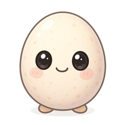
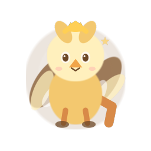
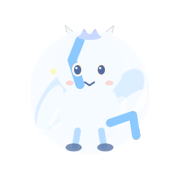
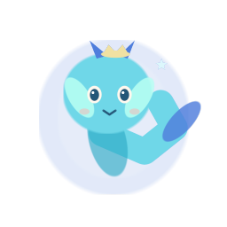
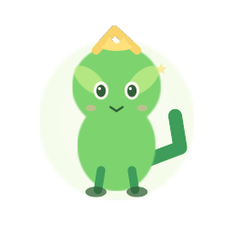
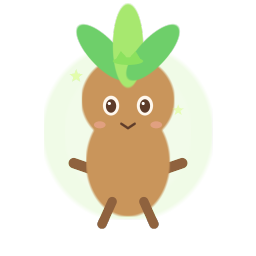

# code-pet

> A desktop companion that grows as you code with Codex or Claude Code.


**code-pet** is a local desktop pet for Codex and Claude Code. A small, always-on-top pet floats on your desktop and **levels up from your real coding activity** — every commit, passing test, and shipped feature grows it from a humble egg into a legendary creature. It also keeps an eye on your session and gently nudges you when your context window is filling up, when uncommitted work is piling up, or when it's time for a break.

It is built around one hard rule: **the pet never touches your project.** The hooks only *observe* activity and write to a private state directory, and the only git commands they ever run are read-only.

<p align="center">
  
  
  
  
  
  
</p>
<p align="center"><em>The phoenix line — egg → hatchling → juvenile → adolescent → adult → legendary</em></p>

## Highlights

- **Grows as you code.** XP comes from commits (a `feat` is worth more than a `chore`), passing tests, new files, milestones, and tokens, with a daily-streak multiplier. Six levels carry your pet from egg to a legendary final form, with a celebratory flash at every evolution.
- **Twelve evolution lines, hatched at random.** Everyone starts from the same generic egg, then hatches into one of twelve creatures chosen randomly (you don't pick). Each grows through six forms while the pre-hatch egg never reveals the species.
- **Moods you can read at a glance.** The pet's body language reflects how things are going: peppy when you're in flow, drowsy when idle, and an anxious sway (plus an encouraging word) when tests keep failing.
- **Gentle reminders.** Speech bubbles for a near-full context window, uncommitted changes piling up, or a long stretch without a break.
- **Lives on your desktop.** A frameless, transparent, always-on-top window. Drag it anywhere (it remembers), click for a stats panel, double-click to feed it a treat — and it wanders along the bottom edge on its own. Clicks pass through everywhere except the pet itself.
- **2.5D-ready art.** The three.js renderer can stage a sprite as layered transparent planes when `assets/layers/<line>/<form>/manifest.json` exists, with automatic fallback to the original pose PNGs.
- **Read-only by design, and tested.** Pure-Node engine with zero runtime dependencies, 151 tests, and a dedicated suite that enforces the no-side-effects invariant.

## How it works

A decoupled, two-stage architecture: platform adapters observe and persist; the widget reads and renders. The two halves communicate only through files under the resolved pet home (`CODE_PET_HOME`, `CLAUDE_PET_HOME`, existing legacy `~/.claude-pet`, or default `~/.code-pet`), so the engine is fully testable without a GUI and can never affect your repository.

```
Claude Code hooks             Codex event JSON
   │                                  │
   ▼                                  ▼
 bin/hook.js                 bin/codex-hook.js
   │                                  │
   └──────────────┬───────────────────┘
                  ▼
 src/activity.js ── reads ──▶ git status/log (read-only) · transcript · session cost
   │
   │ writes (only here)
   ▼
 pet.json     persistent pet: level, xp, mood, achievements
 status.json  latest project snapshot: provider, context %, cost, alerts
   │
   │ file watch
   ▼
 Electron widget (widget/main.cjs) ── renders ──▶ the floating pet
```

## Requirements

- Node.js ≥ 18
- Codex or Claude Code (for automatic activity events)
- Electron — installed as a dev dependency by `npm install`; only needed to display the widget
- macOS, Windows, or Linux (the transparent, always-on-top window behaves best on macOS)

## Installation

### As a Claude Code plugin (recommended)

```
/plugin marketplace add wangkuan100-cell/claude-pet
/plugin install claude-pet
```

### From source

```
git clone https://github.com/wangkuan100-cell/claude-pet.git
cd claude-pet
npm install     # pulls Electron for the widget
node --test     # optional: run the test suite
```

## Usage

### Grow and hatch

Everyone starts as an egg. **Which creature it hatches into is random — you don't choose.** Keep coding and it hatches once it grows past level 1.

```
/pet                         # status: level, mood, xp, project, alerts
/pet rename Ember            # give it a name
/pet milestone "shipped v1"  # log a milestone (+300 xp)
```

Outside Claude Code the same commands work via `node bin/pet.js <command>`.

### Feed it from Codex

Codex can send local JSON events to the universal adapter:

```
echo '{"provider":"codex","event":"tool_result","sessionId":"codex-session","cwd":"'$PWD'","tool":{"name":"Write","input":{"content":"a\nb\n"}},"result":{"type":"create"}}' \
  | node bin/codex-hook.js
```

The Codex adapter accepts both the nested `tool/result` shape above and the Claude-shaped `hook_event_name` / `tool_name` / `tool_input` shape.

### Show the pet

```
/pet start       # launch the floating widget
/pet stop        # hide it
npm run widget   # or run it directly
```

Set `CLAUDE_PET_AUTOLAUNCH=1` to open the widget automatically at session start.

### Interacting with the widget

- **Drag** the pet to move it anywhere — it remembers where you put it.
- **Click** to open or close the stats panel (level, XP bar, mood, project, achievements).
- **Double-click** to feed it a treat — a small mood boost, with floating hearts.
- **Right-click** for a menu of toggles — wandering, reminder bubbles, always-on-top — plus quit. Your choices are remembered across restarts.
- It **wanders** along the bottom edge on its own every ~40s (toggle it from the right-click menu; `CLAUDE_PET_WANDER=0` starts it off).
- The window is **click-through** everywhere except the pet, so it never blocks what's behind it.

### Appearance (Live2D / 3D / 2D)

The widget chooses the best renderer available for the current pet:

1. **Live2D (local model when present)** — if `assets/live2d/<line>/<form>/model3.json` is complete, the renderer lazily loads that Cubism 3/4 model and routes mood, cursor focus, feed, hop, level-up, and evolve reactions into Live2D. Cubism Core is proprietary and is not bundled; `petlive2d.js` can load runtime scripts from its defaults or from `window.__LIVE2D_LIBS__`. See `assets/live2d/README.md` for the folder contract.
2. **3D / soft sprite** — the default fallback stages the stable PNG in three.js with soft-body motion, depth, and shadow. The old generated pose variants are not looped by default because they are not consistent action strips.
3. **2D** — the plain chibi sprite is used if WebGL or the richer renderers are unavailable.

## The growth model

### XP

| Event | XP |
|---|---|
| Commit — `feat` | 120 |
| Commit — `fix` | 60 |
| Commit — `refactor` / `perf` | 50 |
| Commit — `test` / `docs` / `chore` / other | 40 |
| Milestone | 300 |
| Passing test | 40 (cap 160 / session) |
| New file | 15 |
| Lines changed | 1 each (cap 30 / event, 200 / session) |
| Tokens | 5 per 100k |

A daily **streak** multiplies earned XP up to 2×.

### Levels and forms

| Level | Cumulative XP | Form |
|---|---|---|
| 1 | 0 | egg |
| 2 | 150 | hatchling |
| 3 | 450 | juvenile |
| 4 | 1,000 | adolescent |
| 5 | 2,200 | adult |
| 6+ | 4,500+ | legendary |

### Mood

Mood starts at 80/100. Good events raise it; it decays about 5 points per hour while idle. Rather than a label, mood is shown through the pet's animation — flow, happy, normal, sleepy, bored. Three failing tests in a row turn it *worried*: it sways and offers an encouraging message, instead of penalizing the normal red-test phase of TDD.

### Reminders

The pet raises a speech bubble when:

- the context window is ≥ 80% full → suggests `/compact`
- 15+ files are uncommitted, or there's been no commit in 2 hours → suggests committing
- it's been 90+ minutes without a break → suggests a rest

### Achievements

`first-hatch` · `first-feat` · `first-green` · `first-release` · `week-streak` (7-day streak) · `century` (100 commits)

## Evolution lines

<p align="center">
  
  
  
  
  
  
  
  
  
  
  
  
</p>

phoenix 凤凰 🔥 · dragon 龙王 🐉 · kitsune 九尾狐 ✨ · cerberus 地狱犬 🐺 · sphinx 狮身兽 🦁 · golem 魔像王 💎 · unicorn 独角兽 🦄 · griffin 狮鹫 🦅 · pegasus 天马 🐴 · leviathan 小海龙 🌊 · basilisk 蛇羽蜥 🐍 · mandrake 曼德拉草 🌿

## Configuration

| Variable | Default | Purpose |
|---|---|---|
| `CODE_PET_HOME` | auto | Preferred universal state directory override |
| `CLAUDE_PET_HOME` | auto | Legacy state directory override, still supported |
| `CLAUDE_PET_WANDER` | on | Initial default for wandering (toggle it live from the right-click menu); set to `0` to start with it off |
| `CLAUDE_PET_AUTOLAUNCH` | off | Set to `1` to open the widget at session start |
| `CLAUDE_PET_CONTEXT_WINDOW` | `200000` | Token budget used to estimate context % |

## Art

The committed art includes one shared pre-hatch egg plus 12 post-hatch creature lines, with extra pose frames for animation. The original image-model sprites can be regenerated with the OpenAI Images API:

```
OPENAI_API_KEY=sk-... npm run gen-art            # all lines
OPENAI_API_KEY=sk-... npm run gen-art phoenix    # a single line
```

Generation uses `gpt-image-1`, which supports the transparent backgrounds the floating window needs (override with `OPENAI_IMAGE_MODEL`). The expanded local creature pack can also be rebuilt without an API key:

```
npm run gen-expanded-art
```

Runtime always uses `assets/egg.png` before hatching, so there are no per-species egg PNGs to reveal the random outcome early. Until a post-hatch PNG exists, the pet falls back to an emoji.

### 2.5D layered sprites

Layered assets are optional and live under `assets/layers/<line>/<form>/`. Each folder has a `manifest.json` plus transparent PNG layers on the same 256×256 canvas as the source sprite. The current showcase set covers `dragon/legendary`, `phoenix/legendary`, and `kitsune/legendary` with consistent z-depth, sway, tilt, and phase values. Each set starts with a full base layer, then adds light animated accent layers so the pet never shows cut-out holes while moving.

To rebuild those prototypes, run:

```
python3 art/build-2p5d-layers.py
```

The script requires Pillow. If a layer manifest is missing or incomplete, the widget keeps using the original pose PNG animation.

## Development

```
node --test       # run all 151 tests (node:test, zero config)
npm run widget     # launch the Electron widget
```

The engine and hooks are plain ESM with no runtime dependencies. `test/no-side-effects.test.js` exists specifically to enforce the read-only invariant.

### Project structure

```
src/        pure engine — xp, levels, mood, achievements, git parsing, state I/O
bin/        hook entry (hook.js) · CLI (pet.js) · autolaunch
widget/     Electron main, preload, renderer (the floating pet),
            plus wander / feed / position logic
art/        OpenAI image-generation script and prompts
assets/     generated sprites — <line>/<form>.png
commands/   the /pet slash command
skills/     the claude-pet skill
hooks/      hook registration (hooks.json)
test/       node:test coverage for engine, hooks, renderer bridges, rigs, and assets
docs/       design specs and implementation plans
```

## License

[MIT](LICENSE) © kuan
